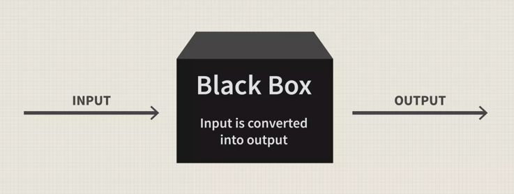

# Függvények

## Mi a függvény?

- A függvények olyan kódrészletek, amelyeket újra és újra és újra felhasználhatunk. 
- A függvények segítségével a kódunkat átláthatóbbá és könnyebben karbantarthatóvá tehetjük. 
- A függvények segítségével a kódunkat kisebb részekre bonthatjuk, amelyeket külön-külön tesztelhetünk és fejleszthetünk.
- A függvényeknek megadhatunk bemeneti paramétereket, amelyek segítségével a függvény működését befolyásolhatjuk. </br>


## Hogyan épül fel egy függvény?

### Egyszerű függvény

```python
def print_my_name():
    print("Vince vagyok")
```
- A python függvényeket a `def` kulcsszóval hozzuk létre.
- Ezután a `print_my_name` kifejezés a függvény neve. A későbbiekben ezt a nevet használjuk a függvény meghívására.
- Ezután egy `()` zárójel következik, amely a függvény bemenő paramétereit tartalmazza. Ezt egyelőre üresen hagyjuk.
- A függvényt lezáró kettőspont `:` után a függvény törzsét írjuk le. Ebben a példában ez egy `print` függvény, amely kiírja a képernyőre a "Vince vagyok" szöveget.
- <font color="red">**❗❗❗️SZINTAXIS❗❗❗**</font> A függvény törzsét mindig egy tabulátorral beljebb kell kezdeni, mint a függvény definíciója.

A további függvénytípusokat a következő oldalakon fogjuk részletezni.

