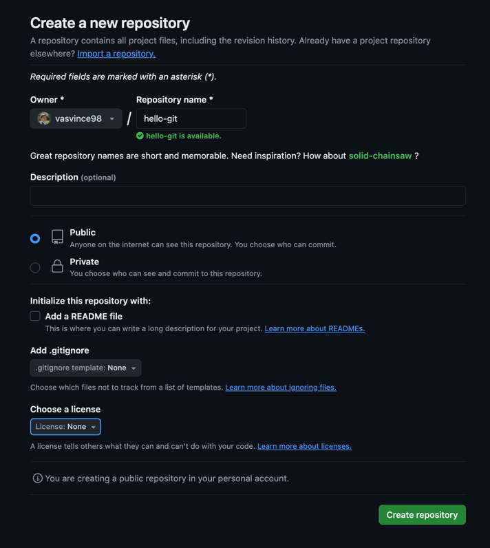

# Github

## Mi az a github?
A Github egy olyan web-alkalmazás, ahol kezelni tudjuk a git projektjeinket.
Megnézhetjük a különböző branch-ek aktuális állapotát a projektjeinkben, valamint más, nyílt forrsákódú projekteket is használhatunk, 
hozzájárulhatunk.

### Git vs. Github

Fontos megkülönböztetni a kettőt. A Git a szoftver,amit a verziókövetésre használunk, a Github pedig az a szoftver,
ami szintén Git-et használ a háttérben,
megkönnyítve nekünk a projektjeink kezelését és tárolását.

### Mire használjuk a Github-ot?

Amikor lokálisan a saját számítógépünkön dolgoztunk egy kódon, elmenthetjük azt, lényegében egy felhőbe. Erre sokféle
Git kompatibilis alkalmazást találhatunk, de az egyik legnépszerűbb a Github.

### Github repository létrehozása

  
