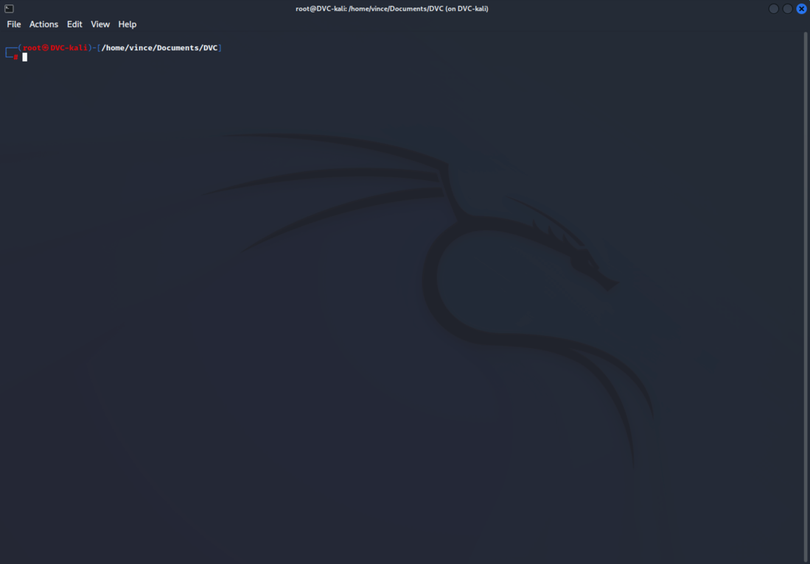
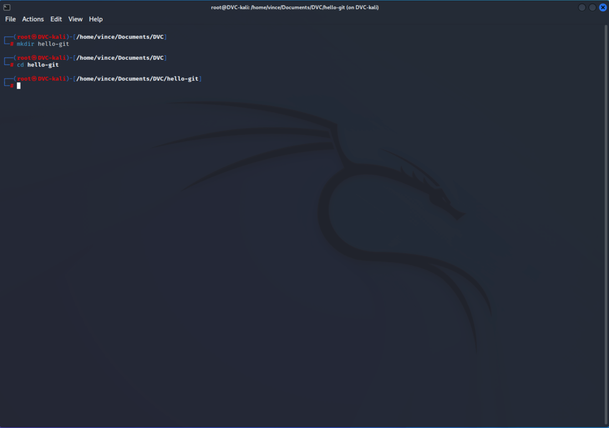
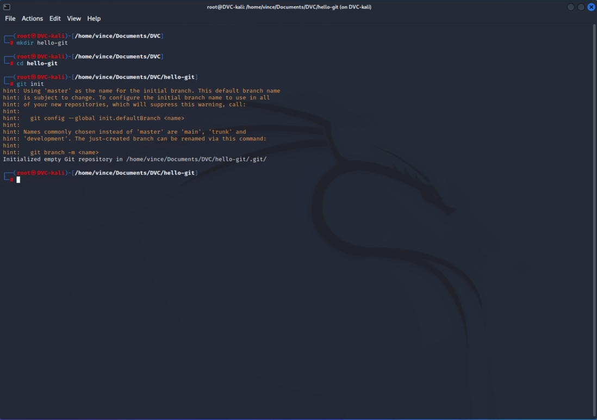
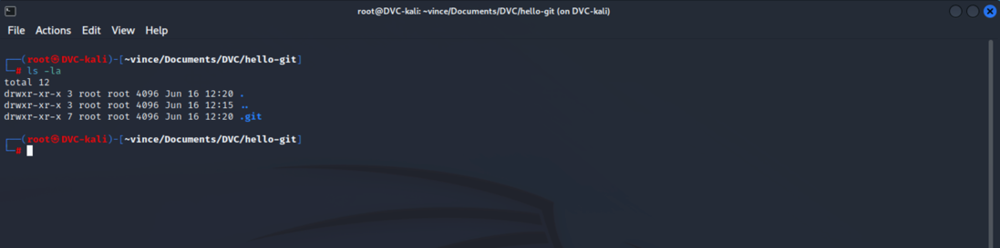

# Git projekt létrehozása

1. Git telepítése, bejelentkezés
2. Projekt mappa létrehozása

> Belépünk abba a mappába, ahol a projektünket szeretnénk létrehozni:
>   
> A /home/vince/Documents/DVC az a mappa szerkezet, amin belül most éppen tartózkodunk, tehát jelenleg a DVC mappán belül vagyunk.
> Létrehozunk egy új mappát, ez lesz a projekt könyvtárunk: Parancs: `mkdir hello-git`, majd a `cd hello-git` paranccsal elépünk az újonnan létrehozott mappába.    
>   
> El is készült az új projekt könyvtárunk

3. Git projekt inicializálása

> A következő lépés, hogy megmondjuk a Git-nek, hogy mostantól ebben a mappában végezzen verziókövetést, ezt hívjuk inicializálásnak. Parancs: `git init`
> Ha kiadtuk a parancsot az alábbi látvány tárul a szemünk elé:  
>   
> Ez azt jelenti, hogy innentől kezdve minden, ami változtatást végzünk, az a master nevű branch-en fog történni. Az utolsó sorban pedig azt láthatjuk, hogy létrehozott egy .git nevű rejtett mappát. Ezt az `ls -la` paranccsal tudjuk megnézni.
>   
> Mostantól kezdve már tudjuk használni a Git funkcióit, de csak ezen a mappán belül.