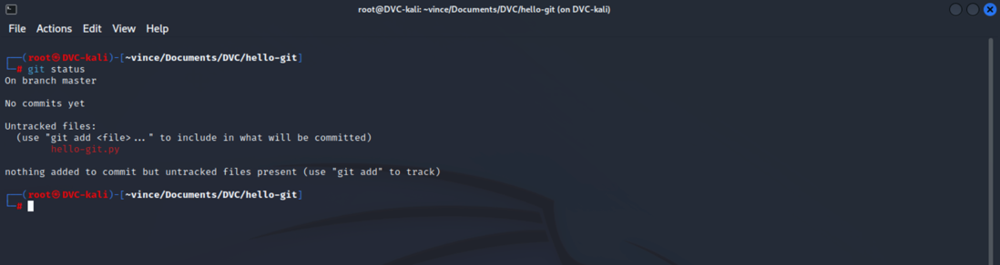

# Git státusz

1. Git státusz üres mappára
> Miután létrehoztuk a projektet adjuk ki a `git status` (fontos, hogy abban a mappában legyünk ahol a `git init`
> parancsot is kiadtuk, tehát ahol a .git mappánk van)
>   
> Nézzük végig egyesével miket látunk:
>> ***On branch master:*** Az első sor azt mondja meg nekünk, hogy milyen branchen vagyunk éppen. Ez majd akkor lesz fontos, 
>> amikor több branchen is dolgozunk, egyelőre csak a `master` nevű branch létezik.    
>> ***No commits yet:*** Itt látjuk majd a commit-olt változtatásainkat. Mivel még nem csináltunk semmit,
>> és nem is commit-oltunk, ezért látjuk ezt az üzenetet.    
>> ***nothing to commit:*** Ez az üzenet pedig azt jelenti, hogy nincsen semmilyen változás a projekt mappánkban
2. Git státusz egy fájlra
> Hozzunk létre egy python fájlt: `touch hello-git.py`, az `ls -la` paranccsal ellenőrihetjük a appa tartalmát, 
> láthatjuk, hogy a .git mappa mellett ott az új fájl.
>   
> Ezután nézzük meg mégegyszer az aktuális státuszt. Parancs: `git status`
>   
> Ismét nézzük meg mit látunk:
>> ***On branch master:*** A branch amin dolgozunk, továbbra is `master`, ez nem változott
>> ***No commits yet:*** Továbbra sem commit-oltunk semmit, így ez is változatlan.
>> ***Untracked files:*** Ezt az üzenetet viszont eddig nem láttuk. Az `untracked files` alatt lesznek felsorolva
>> azok a fájlok, amiket bár létrehoztunk a git projektünkben, de nem mondtuk meg a git-nek,
>> hogy ezt a fájlt figyelnie kell. Az utolsó üzenet is erre vonatkozik.
3. Fájl hozzáadása a Git-hez
> Ha azt szeretnénk, hogy a git kezelje ezt a fájlt, az alábbi parancsok egyikével hozzá adhatjuk:
>> * `git add hello-git.py`: Ezzel a paranccsal, csak a megadott fájlt fogjuk engedélyeznk a Git-nek, hogy kövesse.
>> Ha tehát kiadjuk a `git add hello-git.py` parancsot (látszólag nem történik semmi), és ismét kiadjuk a `git status` 
>> parancsot, ismét láthatunk egy változást:
>>   
>>> `Changes to be commited`: Itt már tudja a Git, hogy figyelni kell ezt a fájlt, és jelzi is nekünk, hogy ez bizony 
>> egy új fájl, amit eddig nem commit-oltunk fel.
>> * `git add .`: Ez a parancs minden fájlt hozzáad a Git-hez, ami az adott mappában található. Ha a másik
>> megközelítést használjuk, akkor is erre az eredményre fogunk jutni:
>>   

## Összefoglalva

* Amikor szeretnénk a fájljaink aktuális állapotát lekérdezni a Git-től, használjuk a `git status` parancsot.
* A `git add` paranccsal még nem csináltunk mást, csak megmondtuk a Git-nek, hogy mostantól figyelje az adott fájlt. Innentől kezdve, ha bármi változás történik a fájlban a Git tudni fogja és nekünk is szól róla, mert nagyon kedves. Nem úgy mint a mai fiatalok...

