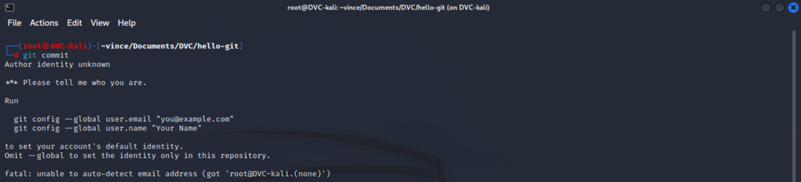
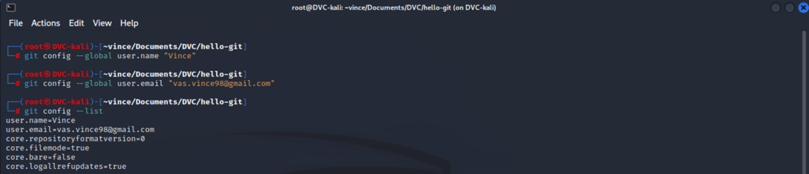
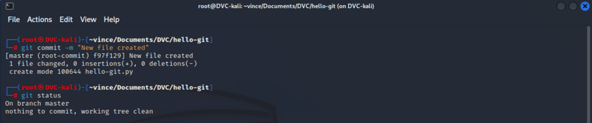

# Git commit

Ott tartunk tehát, hogy a `git add` paranccsal megmondtuk a Git-nek, hogy mostantól figyelje ezt a fájlt, és
ezután ő szólt is nekünk, hogy ez a fájl új, ideje lenne `commit`-olni.

## Mi az a commit?

Amikor a `git commit` parancsot használjuk, a Git létrehoz egy "pillanatképet" a kódunkról. 
Ez a pillanatkép tartalmazza az összes változást, amit a legutóbbi commit óta hajtottál végre.
Esetünkben ez egy darab új fájl létrehozása.  

1. Első commit
> 1. Az első `commit`-unk létrehozásához adjuk ki a `git commit` parancsot
>> Első lehetséges hiba:
>>   
>> Ha még korábban nem állítottuk be a gépünkön a Git-nek, hogy kik vagyunk, akkor ezt az üzenetet fogjuk látni.
>> A Git segít is nekünk, megmutatja, hogy milyen parancsokkal tudjuk ezt megtenni:
>> * `git config --global user.email "you@example.com"`
>> * `git config --global user.name "Your Name"`  
>> * Az idézőjelek közé meg kell adnunk az e-mail címünket és felhasználónevünket. A commit-jaink és különböző tevékenységeink ezekhez
>>az adatokhoz letnek kötve, innen fogja tudni a Git, hogy ki mit csinált.
>>A `git config --list` paranccsal tudjuk ellenőrizni, hogy sikerült e:  
>>  
>
> 2. Miután kijavítottuk a hibát, ismét adjuk ki a commit parancsot, de ezúttal egészítsük ki: `git commit -m "New file created"`  
> A `-m` azt jelenti message. Ugyanis a Git nem engedi, hogy commit-oljunk komment nélkül. a -m után megadhatjuk, 
> hogy mi legyen a kommentünk ehhez az adott üzenethez. Célszerű olyat adni, ami röviden de lényegre törően leírja 
> mit is commit-olunk.
>   
> Ezután a jól ismert `git status` parancsot kiadva láthatjuk, hogy megint nincs mit commit-olni, minden változtatást commit-oltunk.

**FONTOS:** Amikor commit-olunk, a kód még mindig a számítógépünkön van. Így ha például tönkre megy a merev lemez a 
változtatás ugyanúgy elveszik.