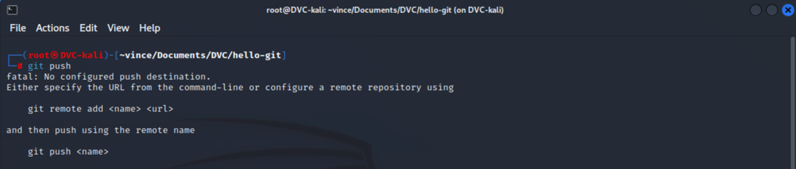

# Git push

Ha szeretnénk a commit-jainkat, és ezzel a kódunk aktuális állapotát elmenteni azt a `git push` paranccsal tehetjük meg.
Ez a parancs fel fogja push-olni a változtatásainkat a kiválasztott repository-ba, esetünkben a Github-ra.

## Hova is fogunk push-olni?

Könnyű azt mondani, hogy mi Github-ra push-olunk, a gond csak az, hogy a számítógépünkön ezt nem mondtuk meg a Git-nek.
Így ha kiadjuk a `git push` parancsot, az alábbi üzenetet kapjuk:
  

Ez azért történik, mert bár mi a saját gépünkön létrehoztuk a projektet, a Github erről mit sem tud
> (továbbra se felejtsük el, a Git egy szoftver ami a verziókövetésért felel, a Github pedig egy web alkalmazás,
ami szintén Git-et használ, és segít nekünk a projektjeink kezelésében)

A 2-es pontban már láttuk, hogy hogyan tudunk létrehozni Github-on egy repository-t. Most az ott létrehozott repository-t fogjuk használni.
